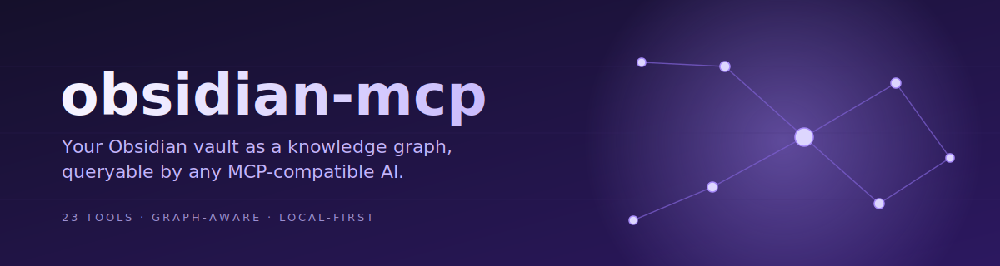

<div align="center">



# obsidian-mcp

### Treat your Obsidian vault as a knowledge graph that AI agents can actually use.

A [Model Context Protocol](https://modelcontextprotocol.io) server that gives Claude — and any other MCP-compatible AI — graph-aware access to your notes. Backlinks, multi-hop traversal, Dataview queries, daily-note awareness, batch note creation, and safe rename-with-backlink-rewrite, exposed as 25 typed tools.

[](https://www.npmjs.com/package/obsidian-mcp)
[](https://github.com/yanxue06/obsidian-mcp/actions)
[](LICENSE)
[](https://modelcontextprotocol.io)
[](tsconfig.json)
[](https://github.com/yanxue06/obsidian-mcp/stargazers)

[**Setup**](#setup) · [**What you can do**](#what-you-can-do-with-it) · [**Tools**](#tool-catalog) · [**Configuration**](#configuration) · [**FAQ**](#faq)

</div>

---

## Why this exists

Most "Obsidian + AI" integrations expose `read_file` and `write_file`, then ask the model to figure out the rest. That works for a five-note vault. It collapses on a 5,000-note vault the moment you ask anything graph-shaped — *"what connects these two ideas?"*, *"what have I forgotten to follow up on?"*, *"reorganize this folder."* Each question becomes a chain of dozens of `read_file` calls, blowing through your context window before the model has even started thinking.

`obsidian-mcp` exposes **the graph itself** as tools:

- **`get_note`** returns content + backlinks + forward links + tags + frontmatter in *one* call.
- **`traverse_graph`** walks N hops out from any starting note in one call — forward, backward, or both — returning nodes and edges as a subgraph.
- **`query_dataview`** passes Dataview DQL straight through, so the model can ask *"all notes tagged #project where status != done sorted by due date"* as a single typed query.
- **`move_note`** renames a note **and rewrites every incoming wiki-link** so the graph survives the rename. This unblocks the entire "reorganize my vault" class of prompts that other servers can't safely do.
- **`create_notes`** creates many notes in a single tool call — useful for bootstrapping an MOC plus its topical notes without paying N round-trips.

It's a small server (TypeScript, ~2,000 LOC, three runtime deps), runs locally over stdio, and works with Claude Desktop, Claude Code, Cursor, Cline, Continue, and Zed.

## What you can do with it

Real prompts you can drop into Claude Desktop after installing:

> **Build an index note (Map of Content).** *Build me an index note for everything I've written about distributed systems. Use `traverse_graph` from "Distributed systems.md" with depth 2, cluster the neighbors thematically, and write the result to `MOCs/Distributed Systems MOC.md`.* (MOC = Map of Content, a curated index note — Obsidian convention.)

> **Surface forgotten work.** *Find every note tagged `#project` where `status != "done"` and the due date is this week.* (Single `query_dataview` call.)

> **Daily review.** *What's in my daily note today? Anything I forgot to follow up on from yesterday's note? Append my action items to today.*

> **Inbox triage.** *Find all my orphan notes in `Inbox/`. For each one, read it, suggest where it belongs, and ask me before moving anything.*

> **Bootstrap a topic.** *I just started studying transformer architectures. Use `create_notes` to scaffold a `MOCs/Transformers MOC.md` plus stub notes for "Self-attention", "Multi-head attention", "Positional encoding", and "Layer normalization", each linking back to the MOC.*

> **Safe refactor.** *Rename "Atomic notes.md" to "Evergreen notes.md" using `move_note`. Update every backlink so nothing breaks.*

> **Vault analytics.** *Run `get_vault_stats` and `list_tags`. Tell me my top 5 topics by note count, where I write most, and how my vault has grown.*

> **Cross-domain synthesis.** *Walk 2 hops from "Working memory.md" and 2 hops from "Attention.md". Tell me which notes appear in both neighborhoods — those are my cross-cutting ideas.*

If a workflow doesn't fit one of the existing tools, [open an issue](https://github.com/yanxue06/obsidian-mcp/issues) — the [tool catalog](#tool-catalog) below covers what's there today.

## Setup

You need three things wired up: Obsidian running, the Local REST API plugin enabled, and your MCP client pointed at `obsidian-mcp`. The whole flow takes about a minute.

### Step 1 — Install the Local REST API plugin in Obsidian

`obsidian-mcp` reaches your vault through the [Local REST API](https://github.com/coddingtonbear/obsidian-local-rest-api) community plugin. You only do this once per vault.

1. In Obsidian, open **Settings → Community plugins → Browse**.
2. Search for **Local REST API**, then **Install** and **Enable** it.
3. Open the plugin's settings tab. Copy the **API key** shown at the top — you'll paste it into your MCP client config in Step 2.

> [!IMPORTANT]
> Obsidian must be running for `obsidian-mcp` to work. The plugin lives *inside* Obsidian; close the app and the server can't reach your vault.

### Step 2 — Add `obsidian-mcp` to your MCP client

Pick your client below.

<details open>
<summary><b>Claude Desktop</b></summary>

Open the config file (create it if it doesn't exist):

- **macOS:** `~/Library/Application Support/Claude/claude_desktop_config.json`
- **Windows:** `%APPDATA%\Claude\claude_desktop_config.json`
- **Linux:** `~/.config/Claude/claude_desktop_config.json`

Add the `obsidian` entry under `mcpServers`:

```jsonc
{
  "mcpServers": {
    "obsidian": {
      "command": "npx",
      "args": ["-y", "obsidian-mcp"],
      "env": {
        "OBSIDIAN_API_KEY": "paste-your-key-here"
      }
    }
  }
}
```

Quit and reopen Claude Desktop. You should see a tool icon in the input area — click it to confirm the `obsidian` tools are listed.

</details>

<details>
<summary><b>Claude Code</b></summary>

Run once, from any directory:

```bash
claude mcp add obsidian -e OBSIDIAN_API_KEY=paste-your-key-here -- npx -y obsidian-mcp
```

Then fully quit and reopen Claude Code (`/mcp reconnect` doesn't always re-spawn the child process). Verify with `/mcp` — `obsidian` should report **✓ Connected**.

</details>

<details>
<summary><b>Cursor / Cline / Continue / Zed (and other MCP clients)</b></summary>

Add a new stdio MCP server with:

- **Command:** `npx`
- **Args:** `-y obsidian-mcp`
- **Env:** `OBSIDIAN_API_KEY=paste-your-key-here`

Refer to your client's MCP config docs for the exact field names. Any MCP-compatible client works.

</details>

### Step 3 — Verify it's wired up

In your MCP client, ask:

> *"Run `get_vault_stats` and tell me how many notes I have."*

If you get a number back, you're done. If you hit a connection error, check [troubleshooting](#troubleshooting) below.

### Troubleshooting

| Symptom | Likely cause / fix |
| --- | --- |
| `ECONNREFUSED 127.0.0.1:27124` | Obsidian isn't running, or the Local REST API plugin isn't enabled. |
| `401 Unauthorized` | Wrong API key. Re-copy it from the plugin's settings tab. |
| `self signed certificate` warning | Expected — the plugin uses a self-signed cert and `OBSIDIAN_VERIFY_TLS` defaults to `false`. Set it to `true` only if you've replaced the cert. |
| `Failed to reconnect to obsidian` after editing config | Fully quit and reopen the MCP client; in-place reconnect doesn't always re-spawn the child process. |
| Wrong vault is showing up | One server instance points at one running Obsidian instance. Switch vaults inside Obsidian, or register multiple MCP entries with different names. |

## Tool catalog

25 tools, organized by category. **Bold** rows are the differentiators that other Obsidian MCP servers don't expose.

### Discovery — find what's in the vault
| Tool | What it does |
| --- | --- |
| `list_vault` | All files (or one folder), markdown-only by default. |
| `search_vault` | Full-text or `#tag` search, with snippets. |
| **`query_dataview`** | Run a Dataview DQL query. Requires the Dataview plugin in the vault. |
| **`list_tags`** | Vault-wide tag inventory with usage counts and sample notes per tag. |
| **`get_vault_stats`** | Totals (files, notes), sampled word count, top folders, file extensions. |

### Reading — get content out
| Tool | What it does |
| --- | --- |
| **`get_note`** | Content **plus graph context** — backlinks, forward links, tags, frontmatter — in one call. The flagship tool. |
| **`get_outline`** | Heading tree of a note. Use this instead of `get_note` when you only need to navigate. |
| `get_active_note` | The note currently focused in Obsidian. |
| **`get_daily_note`** | Today's daily / weekly / monthly / quarterly / yearly note. |

### Graph — walk and analyze the link structure
| Tool | What it does |
| --- | --- |
| **`get_backlinks`** | Notes that link to a given note, with snippets. |
| **`traverse_graph`** | Walk N hops from a note (forward, backward, or both). Returns nodes + edges. |
| **`find_orphans`** | Notes with no incoming links — forgotten ideas, candidates for cleanup. |
| **`find_broken_links`** | Wiki-links that don't resolve. Run this before bulk renames. |

### Writing — create and modify notes
| Tool | What it does |
| --- | --- |
| `create_note` | New note with optional frontmatter and an auto-generated `## Related` section of `[[wiki-links]]`. |
| **`create_notes`** | Create many notes in a single call. Per-note errors are reported individually; pass `stop_on_error: true` to abort on the first failure. Pre-fetches the file listing once for the whole batch. |
| **`upsert_note`** | Idempotent create-or-update. Replaces body, with optional `merge_frontmatter` to keep existing keys not specified in this call. |
| `update_note` | Replace a note's full content. |
| `append_to_note` | Append markdown to the end of a note. |
| `append_to_daily_note` | Common pattern: agent logs what it did to today's daily. |
| **`patch_note`** | Insert content under a specific heading, block, or frontmatter field — without rewriting the rest. |
| **`move_note`** | Move/rename a note **and update incoming wiki-links** so the graph stays intact. |
| `delete_note` | Destructive — only used when explicitly asked. |

### UI / commands — drive Obsidian itself
| Tool | What it does |
| --- | --- |
| **`open_note`** | Surface a note in Obsidian's workspace. Great closing move for an agent task. |
| `list_commands` | List every registered Obsidian command (built-in + plugin). |
| **`run_command`** | Execute any Obsidian command by id. Lets agents trigger any plugin action. |

## How it works

```
┌──────────────────┐    stdio (MCP)    ┌──────────────┐    HTTPS     ┌──────────────────┐
│ Claude / Cursor  │ ─────────────────► obsidian-mcp ────────────────►  Local REST API  │ ──► Vault
│ Cline / Zed / …  │                   │  (this repo) │              │ (Obsidian plugin)│
└──────────────────┘                   └──────────────┘              └──────────────────┘
```

`obsidian-mcp` is a thin layer over the [Local REST API plugin](https://github.com/coddingtonbear/obsidian-local-rest-api). The plugin runs an HTTPS server inside Obsidian with full vault access; this server adapts that surface into the MCP protocol and adds graph-aware tools that Obsidian's REST API doesn't expose directly (backlinks, multi-hop traversal, orphan detection, safe rename, batch creation).

Everything is local. No data leaves your machine except the requests your MCP client makes to its model provider — and you control that.

## Configuration

All config is via environment variables — set them in your MCP client config.

| Variable | Required | Default | Notes |
| --- | --- | --- | --- |
| `OBSIDIAN_API_KEY` | yes | — | From Local REST API plugin settings. |
| `OBSIDIAN_HOST` | no | `127.0.0.1` | |
| `OBSIDIAN_PORT` | no | `27124` (https) / `27123` (http) | |
| `OBSIDIAN_PROTOCOL` | no | `https` | The plugin defaults to HTTPS with a self-signed cert. |
| `OBSIDIAN_VERIFY_TLS` | no | `false` | Set to `true` if you've replaced the self-signed cert. |
| `OBSIDIAN_TIMEOUT_MS` | no | `15000` | Per-request timeout. |

## Performance & scale

| Vault size | `get_note` (with backlinks) | `traverse_graph` depth=2 | `find_orphans` |
| --- | --- | --- | --- |
| 100 notes | ~50ms | ~150ms | ~1s |
| 1,000 notes | ~150ms | ~600ms | ~6s |
| 5,000 notes | ~400ms | ~2s | ~25s* |

*`find_orphans` and `find_broken_links` accept a `sample_size` parameter — bound them on large vaults to keep tool calls under the model's per-call timeout.

## FAQ

**Do I need to install an Obsidian plugin?** Yes — the Local REST API plugin. It's the only sane way to talk to a running vault from outside. `obsidian-mcp` itself runs as a separate Node process started by your MCP client; you don't install another plugin in Obsidian for this.

**Does it work if Obsidian is closed?** No. The Local REST API runs *inside* Obsidian, so the app needs to be open.

**Does it support multiple vaults?** One server instance points at one running Obsidian instance. Run multiple MCP server entries (different names) if you switch vaults frequently. Multi-vault routing may come later.

**Why HTTPS by default with `OBSIDIAN_VERIFY_TLS=false`?** The plugin ships a self-signed cert. The traffic is loopback-only (`127.0.0.1`), so verification adds friction without a real security gain. If you've replaced the cert, set the flag.

**Is this safe?** The MCP server gives the model whatever access the API key grants — including delete and overwrite. Treat it like any agent with file write access: review what it's about to do, especially before bulk operations. `move_note` is designed for exactly this — making the safe path the default.

**What about concurrency and crashes?** No write-locking and no transaction semantics. If two agents touch the same file simultaneously, the loser's change is lost. `move_note` deletes the source after rewriting backlinks, and `create_notes` is best-effort per entry, so a crash mid-operation can leave partial state. Fine for interactive agent use; not appropriate for unattended batch jobs.

**How do I debug?** Run `node dist/index.js` directly with your env vars and the server prints connection status to stderr. Send JSON-RPC messages on stdin to test. The MCP Inspector ([npm](https://www.npmjs.com/package/@modelcontextprotocol/inspector)) is the easiest way to poke at tools manually.

## Contributing

PRs welcome. See [CONTRIBUTING.md](CONTRIBUTING.md) for the dev loop, tool-authoring conventions, and code-style expectations.

## Acknowledgements

- [Local REST API](https://github.com/coddingtonbear/obsidian-local-rest-api) by **@coddingtonbear** — this entire project is downstream of it.
- The [Model Context Protocol](https://modelcontextprotocol.io) team at Anthropic.
- The Obsidian plugin community, who built the ecosystem this depends on.

## License

MIT — see [LICENSE](LICENSE).

---

<div align="center">
<sub>If this project saved you time or token spend, a star helps others find it.</sub>
</div>
